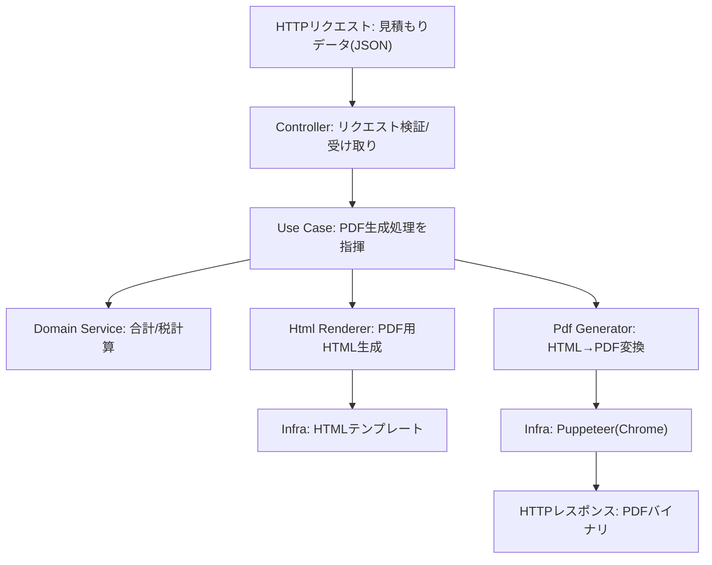

# バックエンド概要

このバックエンドは **クリーンアーキテクチャ** で構成しています。ドメインやユースケースの中心ロジックは、フレームワークやインフラ層に依存しません。

## フォルダ構成

- `src/domain/`
  - **エンティティ** と **ドメインサービス**（純粋なロジック）
- `src/application/`
  - **ユースケース** と **ポート**（インターフェース）
- `src/infra/`
  - インフラ実装（Puppeteer による PDF 生成、HTML テンプレート）
- `src/presentation/`
  - HTTP レイヤー（Express の app / controller / routes）
- `src/main.ts`
  - 起動エントリ（構成の組み立て）

## 処理フロー（Mermaid）



## 仕組み（短く）

1. **Controller** がリクエストを受け取る
2. **Use Case** が処理を組み立てる
3. **Domain Service** が見積もり計算を行う
4. **HTML Renderer** が PDF 用 HTML を生成
5. **PDF Generator** が Puppeteer で PDF を生成

## コマンド

```bash
# 開発サーバ（TS）
npm run dev

# dist/ にビルド
npm run build

# ビルド成果物で起動
npm start
```

## 環境変数

- `PORT`（デフォルト: `3000`）
- `PUPPETEER_EXECUTABLE_PATH`（任意: Chromium のパス指定）
- `FIREBASE_PROJECT_ID`（任意: Firestore からデフォルト印鑑を取得する場合）
- `FIREBASE_CLIENT_EMAIL`（任意）
- `FIREBASE_PRIVATE_KEY`（任意: `\n` を含む文字列で設定）
- `FIRESTORE_STAMP_COLLECTION`（任意: 既定 `stamp_img`）
- `FIRESTORE_STAMP_FIELD`（任意: 既定 `url`）

## Firestore 連携（デフォルト印鑑）

Firestore に Data URL を保存し、PDF 生成やUI表示で利用できます。

- コレクション: `stamp_img`（`FIRESTORE_STAMP_COLLECTION` で変更可）
- ドキュメントID:
  - `DEFAULT_STAMP_DATA_URL`（任意）
  - `DEFAULT_STAFF_STAMP_DATA_URL`
  - `DEFAULT_CREATOR_STAMP_DATA_URL`
- フィールド名: `url`（`FIRESTORE_STAMP_FIELD` で変更可）

Firestore が未設定の場合は環境変数の Data URL を使います。
